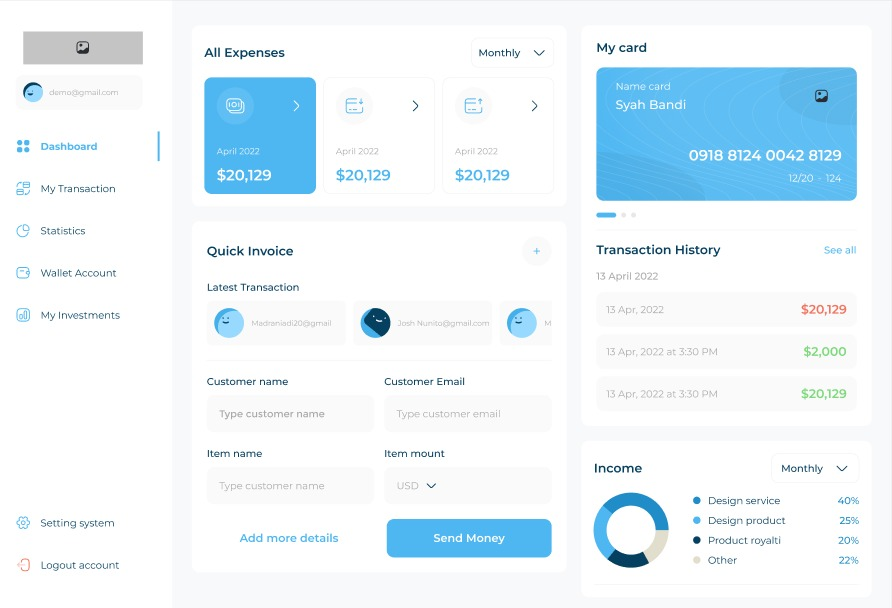

# 💳 Finance Dashboard App

A modern **Flutter Finance Dashboard Application** with a clean and responsive UI.  
This project demonstrates Flutter’s capability to build beautiful, fast, and cross-platform apps.

---

## 🚀 Features
- 📊 **Dashboard Overview** – track all expenses in one place  
- 💵 **Quick Invoice System** – create and send invoices easily  
- 💳 **Wallet & Card Management** – manage accounts securely  
- 📈 **Statistics & Reports** – visualize income & spending  
- 🌐 **Cross-platform** – works on Android & iOS  

---

